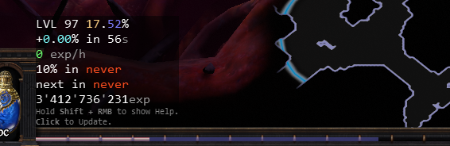
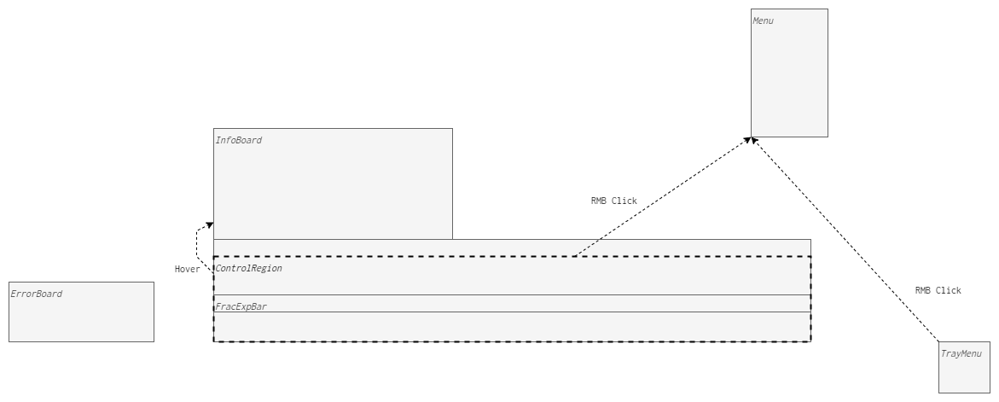
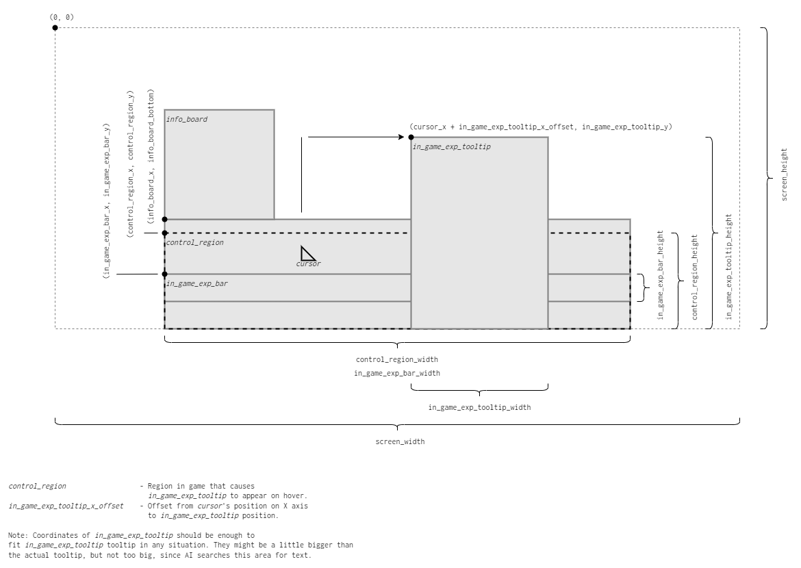

<p align="center"></p>
<p align="center"></p>

# Description

An overlay for the "Path of Exile" game. Displays additional experience bar, which represents experience progress in fractional part of percent (two digits after dot). 

In addition to that, displays other statistics.
Displays average experience gain since last measure, both in exp/h and in percent. 
Displays time needed to gain next level and time needed to gain next 10% of experience. 

# How it works

Requires the "Path of Exile" window to be in "Windowed Fullscreen" mode.

<p align="center"></p>

When you left click on in-game exp bar, then this program takes a screenshot of "Path of Exile" window and scans the part of the screenshot, where the in game exp tooltip is, to fetch current exp value. It's considered as a measure. Calculates an experience gain between last and current measure.

This program brings the "Path of Exile" window back to foreground every time any overlay element is clicked.

It also checks if "Path of Exile" window is on foreground. Then hides overlay if it isn't on foreground, and shows overlay if it is on foreground.

This program doesn't modify any "Path of Exile" files.
This program doesn't read any character data from GGG servers.

# Requirements

|||
|---|---| 
| System | Windows 10 |
| Python | 3.11 64bit |
| py launcher | Yes |
| Path of Exile Language | English |
| Supported Resolutions* | 1280x720, 1920x1080, 2560x1440, 4K |

*) Overlay layout for custom resolutions can be changed or added manually in `settings.json` file. And then loaded through `Menu > Layout > <custom_resolution>`. Meanings for coordinates names are in `docs/images/GUI_Layout.png` file or in [Overlay Positioning](#overlay-positioning) section.

# How to install

*Note: In addition to `poe_exp_after_dot` itself, following external packages are automatically installed by `pip`: `numpy`, `opencv-python-headless`, `easyocr`, `PySide6`.*

## From `.whl` file

Go to `Releases` in github side panel. Download `poe_exp_after_dot-<version>-py311-none-win_amd64.whl` from latest release.
Run `py -3.11-64 -m pip install poe_exp_after_dot-<version>-py311-none-win_amd64.whl` in console window.

# How to uninstall

Run `py -3.11-64 -m pip uninstall poe_exp_after_dot` in console window.

# How to run

Run `start pyw -3.11-64 -m poe_exp_after_dot` in console window.

... or ...

Run `py -3.11-64 -m poe_exp_after_dot --make-run-file` in console window once after install.

It will create `poe_exp_after_dot.bat` on desktop to run overlay.

# Command Line

Run `py -3.11-64 -m poe_exp_after_dot --help` to see available options.

# Hot to quit

`poe exp a. d.` tray icon should be visible on task bar while overlay is running.
<p align="center"></p>
Right click on the tray icon should show a menu. Quit option can be selected from there.
<p align="center"></p>

Or...

Right click on in-game experience bar area should show a menu. Quit option can be selected from there.
<p align="center"></p>

# Controls and Navigation

Actions which can be performed on In-Game Experience Bar Area (also known as ControlRegion):

```
LMB                         - Measure (removes following entries and creates new entry)
Ctrl + LMB                  - Next Entry
Ctrl + Shift + LMB          - Last Entry
Ctrl + RMB                  - Previous Entry
Ctrl + Shift + RMB          - Before First Entry
Hold MMB                    - Show Entry with Page and Date
Scroll Wheel                - Next/Previous Entry
Ctrl + Shift + Alt + LMB    - Remove current Entry with all following Entries
RMB                         - Menu
Hover                       - Show InfoBoard
Hold Shift + RMB            - Show Help
```

Each successful Measure is stored as an Entry. 

Unsuccessful Measures are not stored. They can be recognized by having `ERR` in InfoBoard at very beginning.

*Note: Why unsuccessful measures appear? Current experience value is scanned by AI from in-game experience toolbar. Sometimes scan might not recognize text correctly or be incomplete. Usually when the toolbar does not appear at all. Try measure again if that happens.*

Menu can be accessed from tray icon bar. There should be icon `poe exp a. d.`. Right Click on that icon opens menu.

Glossary:
* `LMB` - Left Mouse Button
* `RMB` - Right Mouse Button
* `MMB` - Middle Mouse Button

# GUI Layout



# Hierarchy of Data Folder

```
<data_folder_name>
    settings.json
    exp_data.json
    runtime.log
    cache/
    formats/
        Default.format
        *.format
    characters/
        <character_name>
            exp_data.json
```

`<data_folder_name>` by default is `poe_exp_after_dot`.

Data folder is located by default in `%APPDATA%/../Local`.

`Default.format` is file where format of InfoBoard text is stored.

`exp_data.json` is file where measure entries are stored.

`character/` is folder where measure entries are stored for specific characters.

# How to run tests

All following actions are taken from project folder.

Run `py -3.11-64 -m pip install -r tests_and_examples_requirements.txt` in command window to install test dependencies.

Run `./RunUnitTests64.bat` in command window to run unit tests.

Run `./Run64.bat` in command window to run `poe_exp_after_dot` locally without install.

Run `./Build64.bat` in command window to build the distribution.

Run `./Clean.bat` in command window to clean temporal data.

# Overlay Positioning 




